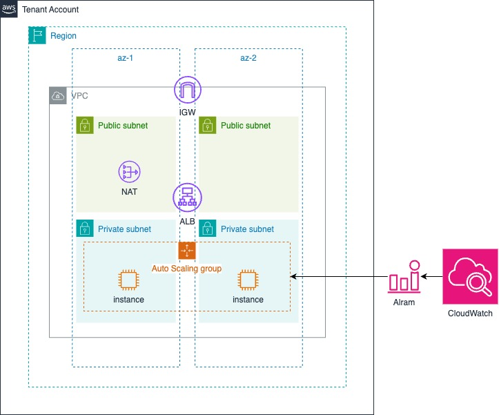

# hanghae-dev-lap-ha-dr

클라우드로 무장한 고가용성 및 장애복구 비법

## 사전 준비사항

이 템플릿을 실행하려면 아래 사전 준비사항이 필요합니다.

- [AWS 계정](https://aws.amazon.com/ko/free/?gclid=Cj0KCQjw28W2BhC7ARIsAPerrcLiRuoz0uwl1ifUPx0xXsrgqJ3rHCsZS8fdXDWNFLY90Zvhs2E8vuwaAoVaEALw_wcB&trk=fa2d6ba3-df80-4d24-a453-bf30ad163af9&sc_channel=ps&ef_id=Cj0KCQjw28W2BhC7ARIsAPerrcLiRuoz0uwl1ifUPx0xXsrgqJ3rHCsZS8fdXDWNFLY90Zvhs2E8vuwaAoVaEALw_wcB:G:s&s_kwcid=AL!4422!3!563761819834!e!!g!!aws!15286221779!129400439466)
- [AWS CLI 설치](https://docs.aws.amazon.com/ko_kr/cli/latest/userguide/getting-started-install.html)
- [AWS 자격 증명](https://inpa.tistory.com/entry/AWS-%F0%9F%93%9A-%EC%9E%A5%EA%B8%B0-%EC%9E%90%EA%B2%A9-%EC%A6%9D%EB%AA%85-%EC%9E%84%EC%8B%9C-%EC%9E%90%EA%B2%A9-%EC%A6%9D%EB%AA%85-Access-Key-Secret-Access-Key)

### 참고사항

- 이 템플릿을 실행하면, 약간의 비용이 발생할 수 있습니다.
- 실습 이후에 사용하지 않을 계획이라면 반드시 스택을 삭제해주세요.

### AWS 자격 증명

## CFN 실행하기

- example/auto-scaling-group/main.yaml 을 실행하면 다음과 같은 리소스가 만들어집니다.
- [CloudFormation이란?](https://docs.aws.amazon.com/ko_kr/AWSCloudFormation/latest/UserGuide/Welcome.html)



### CFN을 업로드할 버킷 생성

```sh
#!/usr/bin/env bash

AWS_PROFILE=# 자격증명 PROFILE 이름을 입력하세요!
BUCKET_NAME=# 템플릿 버킷 이름입니다. S3 버킷이라서, 굴로벌하게 유니크한 이름을 써야합니다. 예) hanghae-cfn-590183776864

aws s3 mb s3://"$BUCKET_NAME" --profile "$AWS_PROFILE"
```

### 템플릿을 S3 버킷에 업로드

```sh
#!/usr/bin/env bash

AWS_PROFILE=# 자격증명 PROFILE 이름을 입력하세요!
BUCKET_NAME=# 생성한 버킷 이름을 입력해주세요!

aws s3 sync . s3://"$BUCKET_NAME" \
  --exclude "*" \
  --include "example/**/*.yaml" \
  --profile "$AWS_PROFILE"
```

### 스택 생성

```sh
#!/usr/bin/env bash

AWS_PROFILE=# 자격증명 PROFILE 이름을 입력하세요!
BUCKET_NAME=# 생성한 버킷 이름을 입력해주세요!
STACK_NAME=# 스택 이름을 임의로 입력해주세요!
MAIN_FILE_PATH=auto-scaling-group/main.yaml

aws cloudformation create-stack \
  --stack-name "$STACK_NAME" \
  --template-url https://s3.amazonaws.com/"$BUCKET_NAME"/example/"$MAIN_FILE_PATH" \
  --parameters ParameterKey=TemplateBucket,ParameterValue="$BUCKET_NAME" \
  --capabilities CAPABILITY_NAMED_IAM \
  --profile "$AWS_PROFILE"
```

### 스택 업데이트

```sh
#!/usr/bin/env bash

AWS_PROFILE=# 자격증명 PROFILE 이름을 입력하세요!
BUCKET_NAME=# 생성한 버킷 이름을 입력해주세요!
STACK_NAME=# 스택 이름을 임의로 입력해주세요!
MAIN_FILE_PATH=auto-scaling-group/main.yaml

aws cloudformation update-stack \
  --stack-name "$STACK_NAME" \
  --template-url https://s3.amazonaws.com/"$BUCKET_NAME"/example/"$MAIN_FILE_PATH" \
  --parameters ParameterKey=TemplateBucket,ParameterValue="$BUCKET_NAME" \
  --capabilities CAPABILITY_NAMED_IAM \
  --profile "$AWS_PROFILE"
```

### 스택 삭제

```sh
#!/usr/bin/env bash

AWS_PROFILE=# 자격증명 PROFILE 이름을 입력하세요!
STACK_NAME=# 스택 이름을 임의로 입력해주세요!

aws cloudformation delete-stack --stack-name "$STACK_NAME" --profile "$AWS_PROFILE"
```

## FAQ

혹시 동작중에 문제가 있거나, 궁금한 점이 있다면 Issue에 올려주세요.

## Todo

- [x] EC2 AutoScalingGroup
- [ ] EC2 웜 풀
- [ ] DynamoDB Read Replica
- [ ] DynamoDB Backup
- [ ] AWS ECS + CodePipeline CI/CD
- [ ] ... (계속 아이디어 생각 중)
